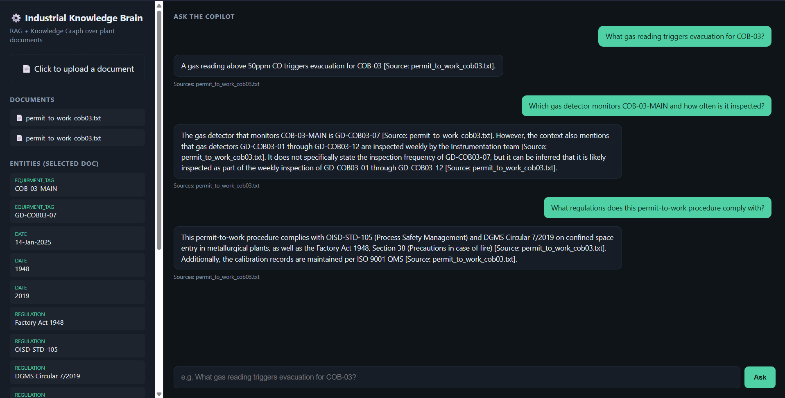
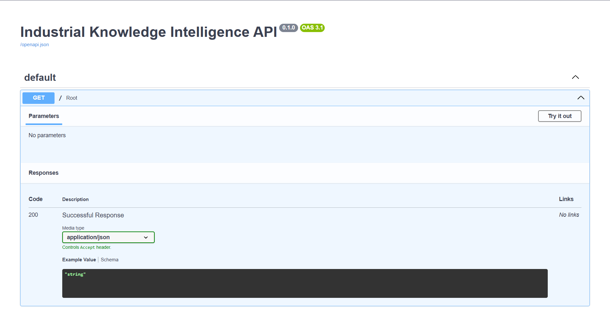

# Industrial Knowledge Intelligence Platform

**ET AI Hackathon 2026 — PS8: AI for Industrial Knowledge Intelligence: Unified Asset & Operations Brain**

A RAG + lightweight knowledge-graph system that ingests heterogeneous industrial
documents (P&IDs, SOPs, maintenance manuals, safety procedures) and makes them
queryable through a cited Q&A copilot, plus an automated regulatory compliance
checker.

## Architecture

```
                       ┌─────────────────────┐
   Upload PDF/TXT ───► │   Ingestion Pipeline │
                       │  parse → chunk       │
                       └──────────┬───────────┘
                                  │
                  ┌───────────────┴────────────────┐
                  ▼                                 ▼
        ┌──────────────────┐             ┌────────────────────────┐
        │  fastembed (ONNX) │             │  Entity Extraction Agent│
        │  → vector index   │             │  (Groq LLaMA 3.3 70B)   │
        └─────────┬─────────┘             └───────────┬────────────┘
                  │                                    │
                  ▼                                    ▼
        ┌──────────────────┐             ┌────────────────────────┐
        │  Vector Store     │             │  Knowledge Graph        │
        │  (numpy/cosine)   │             │  (SQLite entities table)│
        └─────────┬─────────┘             └────────────┬───────────┘
                  │                                    │
                  └─────────────────┬──────────────────┘
                                    ▼
                       ┌────────────────────────┐
                       │  Expert Knowledge       │
                       │  Copilot Agent (RAG)    │
                       │  — Groq LLaMA 3.3 70B   │
                       └────────────────────────┘
                                    │
                                    ▼
                       ┌────────────────────────┐
                       │  Compliance Agent       │
                       │  (OISD/Factory Act/     │
                       │   DGMS checklist)       │
                       └────────────────────────┘
```

**Why these choices (worth saying in your pitch):**
- **fastembed** instead of sentence-transformers/torch — same embedding quality
  for this use case, far lighter install/deploy footprint. Matters when you've
  got hours, not days.
- **SQLite + flat numpy vector index** instead of a hosted vector DB — zero
  external infra dependency for the demo. The `entities` table (doc → entity
  rows) *is* the knowledge graph for now; swapping to Neo4j/Supabase pgvector
  later is a drop-in replacement (see comments in `app/db/`).
- **Groq LLaMA 3.3 70B** for both entity extraction and answer generation —
  fast inference, matches the rest of your project stack.

## Screenshots

**Copilot chat UI — RAG Q&A with source citations and live knowledge graph**



**FastAPI backend — interactive API docs (Swagger UI) showing the `/ingest` and `/ask` endpoints in action**



## Project Structure

```
industrial-knowledge-intel/
├── app/
│   ├── main.py                  # FastAPI app, all routes
│   ├── agents/
│   │   ├── groq_client.py
│   │   ├── entity_extraction_agent.py   # builds the knowledge graph
│   │   ├── copilot_agent.py             # RAG Q&A with citations
│   │   └── compliance_agent.py          # OISD/Factory Act/DGMS checker
│   ├── rag/
│   │   ├── document_parser.py   # PDF/TXT parsing + chunking
│   │   ├── embeddings.py        # fastembed wrapper
│   │   └── ingest.py            # orchestrates the full ingest flow
│   └── db/
│       ├── sqlite_store.py      # documents, chunks, entities, compliance
│       └── vector_store.py      # numpy cosine-similarity index
├── frontend/
│   └── index.html               # single-file chat UI, no build step
├── sample_docs/
│   └── permit_to_work_cob03.txt # test document
├── requirements.txt
├── .env.example
└── .gitignore
```

## Setup

```bash
# 1. clone and enter
git clone https://github.com/<your-username>/industrial-knowledge-intel.git
cd industrial-knowledge-intel

# 2. create a venv (recommended)
python3 -m venv venv
source venv/bin/activate   # Windows: venv\Scripts\activate

# 3. install deps
pip install -r requirements.txt

# 4. add your Groq key
cp .env.example .env
# edit .env and paste your GROQ_API_KEY

# 5. run the backend
uvicorn app.main:app --reload --port 8000
```

Then open `frontend/index.html` directly in your browser (or serve it with
`python3 -m http.server 5500` from inside `frontend/`). It talks to
`http://localhost:8000` by default — change `API_BASE` in `index.html` if you
deploy the backend elsewhere (Render, Railway, etc).

> **Note:** the first time you run ingestion, `fastembed` downloads a small
> ONNX model (~130MB) from HuggingFace. This needs a working internet
> connection on first run only — it's cached locally after that.

## Try it

1. Upload `sample_docs/permit_to_work_cob03.txt` through the UI.
2. Ask: *"What gas reading triggers evacuation for COB-03?"*
3. Click into the document and hit **Run compliance check** to see the
   OISD/Factory Act/DGMS checklist evaluation.

## API Reference

| Method | Route | Purpose |
|---|---|---|
| POST | `/ingest` | Upload a document (PDF/TXT) for processing |
| POST | `/ask` | RAG Q&A — `{"question": "..."}` |
| GET | `/documents` | List ingested documents |
| GET | `/entities/{doc_id}` | Knowledge graph entities for a doc |
| POST | `/compliance-check` | Run regulatory checklist — `{"doc_id": 1}` |
| GET | `/compliance-checklist` | View the default checklist |

Interactive API docs available at `http://localhost:8000/docs` once running.

## What's next (stretch goals if you have time left)

- Swap SQLite/numpy for Supabase + pgvector for a "real" production story
- Add a Maintenance/RCA agent that cross-references entities across documents
- Add multi-document compliance rollup (org-wide compliance score)
- CCTV/P&ID image ingestion via vision model for the computer-vision angle